首先明确假设函数、代价函数、优化代价函数方法及其之间的关系

# 线性回归模型（Linear Regression）

## 假设函数

$$f_{w,b}(x)=w_{1}x_{1}+w_{2}x_{2}+...+w_{n}x_{n}+b$$

如何确定模型中的参数取什么值? 用代价函数

## 代价函数

[代价函数](如何最简单、通俗地理解代价函数？.md)（Cost Function）是用来衡量预测值与实际值之间的误差。它的目的是找到一组参数，使得预测值与实际值之间的误差最小（确定最优参数）。评价模型是否拟合的准确，值越小，拟合的越准确。

**线性回归的代价函数**：最小二乘法。所谓“二乘”就是平方的意思。

$$J(w,b)=\frac{1}{2m}\sum_{i=1}^m\bigl(f_{w,b}\bigl(x^{(i)}\bigr)-y^{(i)}\bigr)^2$$

	此处1/2m中的2仅为了后续求导计算时，简化计算步骤

**注意：**

代价函数中的
$$(f_{w,b}\bigl(x^{(i)}\bigr)-y^{(i)}\bigr)^2$$
部分叫损失函数（Loss Function）用L表示
$$L=(f_{w,b}\bigl(x^{(i)}\bigr)-y^{(i)}\bigr)^2$$
损失函数衡量的是你在一个训练样例上的表现如何，它是通过总结你随后获得的所有训练样列的损失；而代价函数衡量你在整个训练集上的表现。

因此，代价函数值是在损失函数值求和后除以训练量。

线性回归代价函数图：

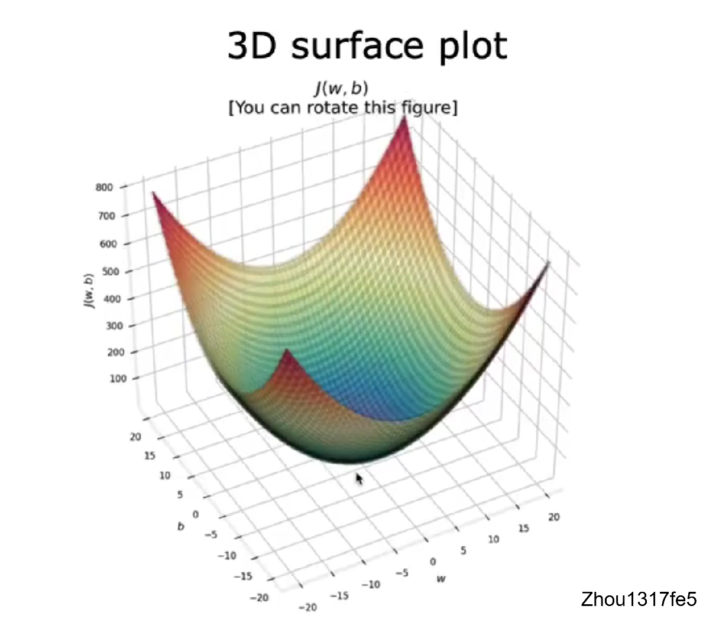

代价函数图自变量为参数，因变量为代价函数值。有代价函数图了，如何自动到达代价函数图的最小值点，即模型拟合最优的点？

## 梯度下降（Gradient descent ）

从代价函数图中找到最小值所在的点。有没有一种算法可以自动地、快速求出使得代价函数最小的点呢？有，那就是**梯度下降**

- 梯度下降的工作是找到希望最小化代价函数J的参数w和b

- 如何快速到达最优点：从山顶一步一步走到山谷，先在原地转一圈，选最陡的地方走一步，在转一圈，在选最陡的一步。这一步一步就是多个梯度下降的步骤。

- 不同的w，b值决定你在那个位置

- 梯度下降算法
   $$
   \begin{aligned}
   w &= w - \alpha \frac{\partial}{d\omega}J(\omega.b) \\
   b &= b - \alpha \frac{\partial}{d\omega}J(\omega.b)
   \end{aligned}
   $$
   
- 梯度下降（Gradient descent ）同时更新w，b。同时更新目的在于，能够确保是在原点寻找最陡方向。赋值就像迈出了一步，先迈出左脚寻找最陡的地方和在原地寻找最陡的地方不一样。
- α学习率决定你迈出的一步有多大
- 导数决定梯度下降方向，学习率决定步长

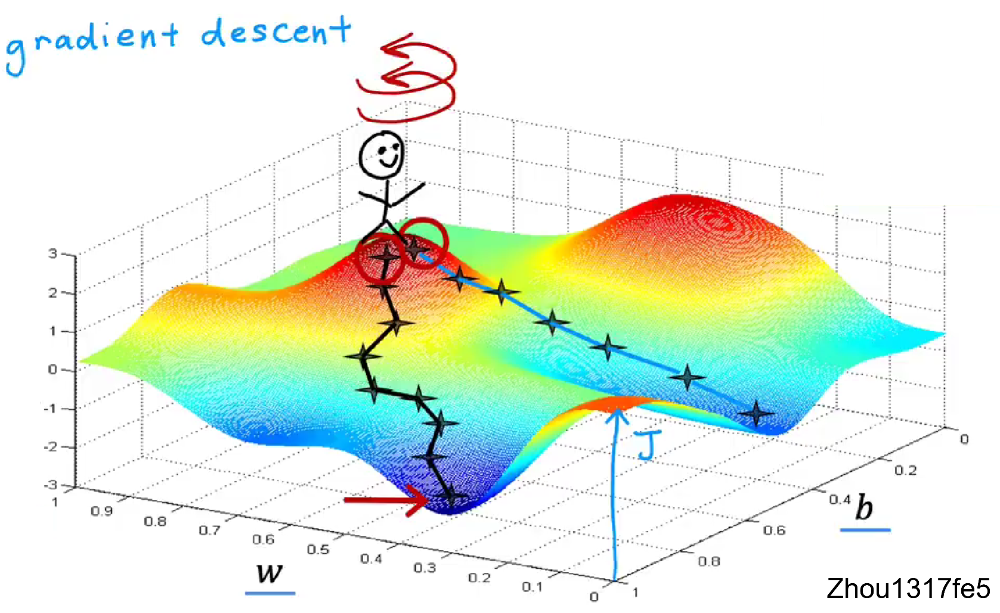

**线性回归的梯度下降：**
$$\begin{aligned}
w&=w-\alpha\frac{1}{m}\sum_{i=1}^{m}(f_{w,b}\big(x^{(i)}\big)-y^{(i)})x^{(i)}\\
b &=b-\alpha\frac{1}{m}\sum_{i=1}^{m}(f_{w,b}(x^{(i)})-y^{(i)})
\end{aligned}$$
## 多维特征

- 矢量化使代码更简短 运行更高效

## 特征缩放（**Feature Scaling**）

房价

$$
pr i c e=w_{1}x_{1}+w_{2}x_{2}+b
$$
$x_{1}$ : size（feet^2）range :300-2000
$x_{2}$ : # bedrooms     range :0-5

当特征的可能值较大时，如房间大小($x_{1}$)，则其参数($w_{1}$)的合理值将相对较小
当特征的可能值较小时，如卧室数量($x_{2}$)，则其参数($w_{2}$)的合理值将相对较大

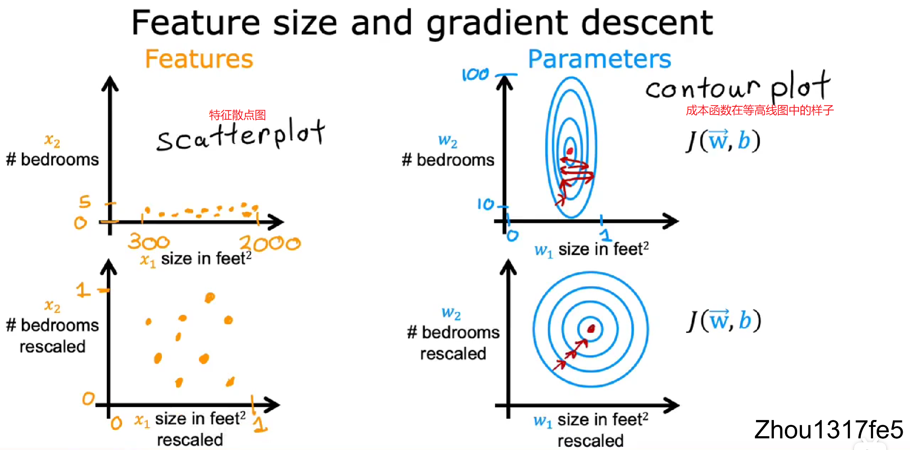

特征散点图如左上时，其代价函数在等高线图中的样子如右上所示，为椭圆形，梯度下降可能会在它最终找到全局最小值之前来回弹跳很长的时间。

所以当你有不同的特征，它们的取值范围非常不同时，它可能会导致梯度下降运行缓慢，但重新缩放不同的特征，使它们都具有可比较的取值范围，让梯度下降法运行得更快。

### 如何实现特征缩放？

将数据标准化、归一化

**平均值归一化方法（Mean normalization）**

如果要将该值映射到\[-1,1\]区间内，则需要计算特征的平均值$X_{Mean}$，使用平均值归一化方法公式为

$$x=\frac{X-X_{Mean}}{X_{Max}-X_{Min}}$$

**Z-score标准化方法（Z-score Normalization）**

标准化法需要提前计算特征的均值$X_{Mean}$和标准差$\sigma$，标准化后的变量值围绕0上下波动，大于0说明高于平均水平，小于0说明低于平均水平。
$$x={\frac{X-X_{M e a n}}{\sigma}}$$

### 缩放的范围是否有固定的要求？

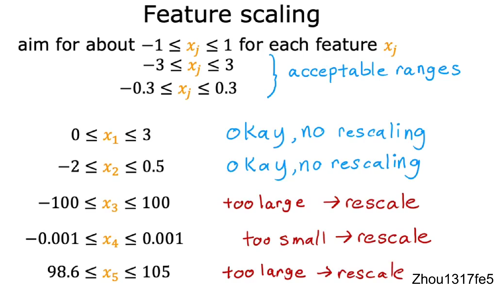

最好是-1到1，实在不行，最大是-3到3，最小是-0.3到0.3，都能接受。

基本意思是，保证各个特征的数量级一致，通过缩放尽量让所有特征的取值在差不多范围，在一个数量级以内的特征可以不考虑缩放，这样它们的变化对预测值的影响都是接近的。

## 判断梯度下降是否收敛？

在运行梯度下降时，怎样才能知道梯度下降是否有效，是否正在找到全局最小值或接近它的值？为了能够选择更好的学习率。

判断梯度下降运行是否良好，用**学习曲线**（learning curve），横轴为梯度下降迭代次数，纵轴为代价函数J。

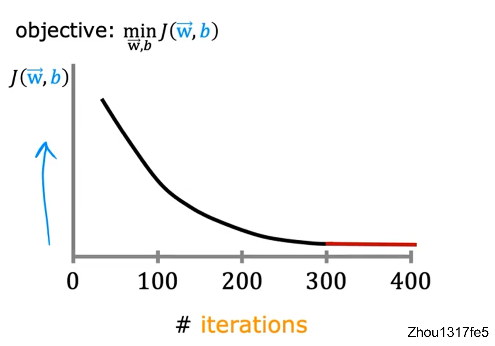
当运行良好时，学习曲线是一直下降的，直到变平（即收敛）；当出现先下降后又上升的情况时，可能是学习率错误，或者程序错误。查看此学习曲线，您可以尝试发现梯度下降是否收敛。

另一种方法是**自动收敛测试**（Automatic convergence test）
令$\epsilon$ ”epsilon“等于一个非常小的数，如果代价J在一次迭代中减少的幅度小于这个数字epsilon,那么很可能位于学习曲线的平坦部分，可以宣布收敛。但是选择正确的阈值epsilon非常困难。

## 如何设置学习率？

当梯度下降函数运行有错误时，可能是学习率太大了或者程序有错误。

- 学习率过大，调小学习率
- 程序有错误，查看公式是否写错，比如把减号写成加号

**尝试不同的学习率并画对应的学习曲线**

……0.001，0.003，0.01，0.03，0.1，0.3，1 …… 

在太小，太大的学习率之间调试。

## 特征工程（feature engineering）

利用领域知识和现有数据，创造出新的特征，用于机器学习算法；可以手动（manual）或自动（automated）。

如果新特征是原始特征的次方，那么特征缩放会非常重要

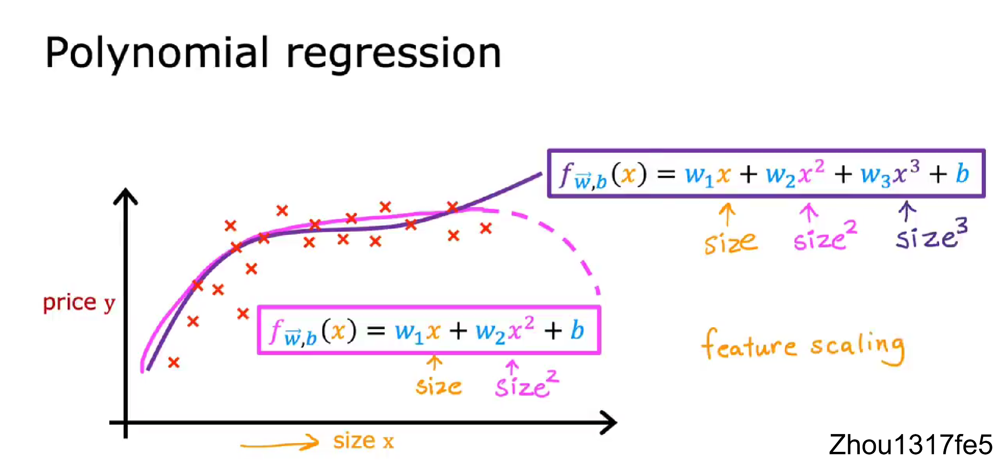

# 分类（Classification）

## 逻辑回归（logistic regression）

### 假设函数

首先介绍sigmoid函数，又称logistic函数

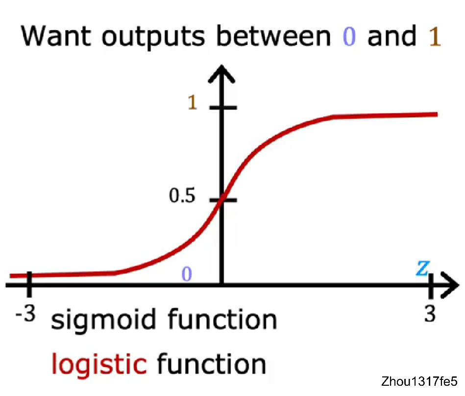

$$g(z)=\frac{1}{1+e^{-z}}\quad0<g(z)<1$$

当z取无限大时，函数趋向于1；当取无限小时，趋向于0。该函数表示结果输出为1的概率。

令
$$\text{Z}=\overrightarrow{W}\cdot\overrightarrow{X}+b$$
则逻辑回归的假设函数为
$$f_{\overrightarrow{W},b}(\overrightarrow{X})=g(\vec{W}\cdot\vec{X}+b)=\frac{1}{1+e^{-(\overrightarrow{W}\cdot\overrightarrow{X}+b)}}$$

### 代价函数 

首先我们回顾一下之前学过的一个代价函数，线性回归的代价函数：
$$J(w,b)=\frac{1}{2m}\sum_{i=1}^m\bigl(f_{w,b}\bigl(x^{(i)}\bigr)-y^{(i)}\bigr)^2$$
如果把此代价函数用在逻辑回归中会怎么样？我们看一下应用该代价函数的代价函数图：

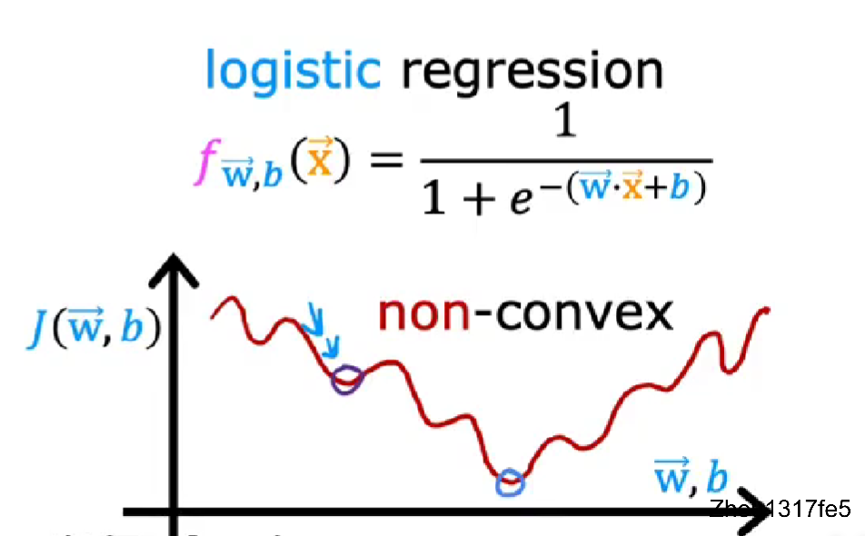

我们发现，，此函数不是凸函数，如果用梯度下降的话，找到的是局部最优，不是整体最优。

	凸函数有个很好的性质，只要能证明是凸函数，最终解一定是全局最优解，即局部最小值是全局最小值。

因此，最小二乘法代价函数不适合逻辑回归。

我们定义**逻辑回归的损失函数**如下（后续说明为何定义该函数）：
$$L\left(f_{\overrightarrow{{{w}}},b}\left(\overrightarrow{{{x}}}^{(i)}\right),y^{(i)}\right)=\left\{\begin{array}{rl}{{-\log\left(f_{\overrightarrow{{{w}}},b}\left(\overrightarrow{{{x}}}^{(i)}\right)\right)}}&{{\mathrm{if~}y^{(i)}=1}}\\ {{-\log\left(1-f_{\overrightarrow{{{w}}},b}\left(\overrightarrow{{{x}}}^{(i)}\right)\right)}}&{{\mathrm{if~}y^{(i)}=0}}\end{array}\right.$$

因此，逻辑回归的代价函数如下：

$$J(\overrightarrow{W},b)=\frac{1}{m}\sum_{i=1}^{m}L\bigl(f_{\overrightarrow{W},b}\bigl(\overrightarrow{x}^{(i)}\bigr),y^{(i)}\bigr)$$

由于y的取值只能是0或1，所以**简化**后的损失函数及代价函数如下：
$$\begin{aligned}
&L{\big(}f_{\overrightarrow{{{w}}},b}{\big(}\overrightarrow{{{x}}}^{(i)}{\big)},y^{(i)}{\big)}=-y^{(i)}\mathrm{log}{\Big(}f_{\overrightarrow{{{w}}},b}{\big(}\overrightarrow{{{x}}}^{(i)}{\big)}{\Big)}-{\big(}1-y^{(i)}\big){\mathrm{log}}{\Big(}1-f_{\overrightarrow{{{w}}},b}{\big(}\overrightarrow{{{x}}}^{(i)}{\big)}{\Big)} \\
&J(\overrightarrow{w},b)=\frac{1}{m}\sum_{i=1}^{m}[L\big(f_{\overrightarrow{w},b}\big(\overrightarrow{x}^{(i)}\big),y^{(i)}\big)]
\end{aligned}$$

那么为什么选择了这个函数作为代价函数呢？

这个特定的代价函数是使用称为最大似然估计的统计原理从统计中推导出来的。最大似然估计是一种常用的参数估计方法，它基于样本数据，通过寻找最有可能产生这些数据的参数值，来确定模型的参数。

### 梯度下降

**==逻辑回归的梯度下降==**
$$\begin{aligned}
w_{j}&=w_{j}-\alpha\frac{1}{m}\sum_{i=1}^{m}(f_{w,b}\big(x^{(i)}\big)-y^{(i)})x_{j}^{(i)}\\
b &=b-\alpha\frac{1}{m}\sum_{i=1}^{m}(f_{w,b}(x^{(i)})-y^{(i)})
\end{aligned}$$

注意：形式与线性回归一样，但是$f_{w,b}(x)$ 表达式不同。

# 过拟合

## 欠拟合、过拟合

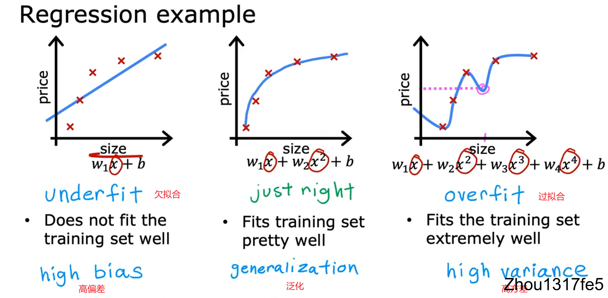

左图，欠拟合（underfit），也称作高偏差（High-bias），即对于当前数据集的拟合程度不够，欠拟合的特征是在训练集和测试集上的准确率都不好；

中图，拟合刚好的状态，具有泛化能力；

右图，过拟合（overfit），也称作高方差（High variance），过拟合对于当前训练数据拟合得太好了，以至于模型只在当前的训练集上表现很好，而在其他数据集上表现就不是那么好，所以过拟合的特征是在训练集上准确率很高而在测试集上表现一般。

## 解决过拟合

方法：
	1. 收集更多的数据
	2. 减少特征数量
	3. 正则化

### 特征工程

### 正则化

将正则化应用在代价函数中，使用正则化来减小参数的大小

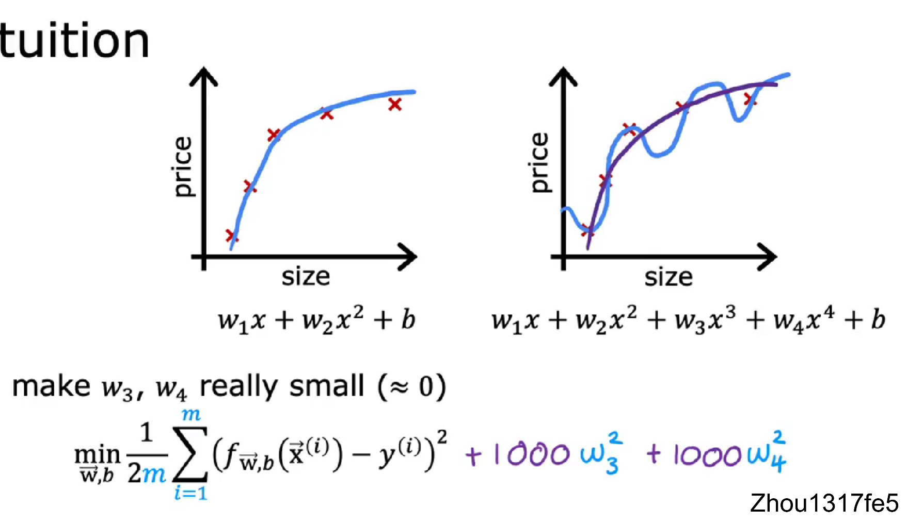

如何理解上式？

因为$w_3^2$和$w_4^2$前的系数非常大，要想使整个式子最小化，只能令$w_3^2$和$w_4^2$ 非常小（$\approx0$），$w_3$和$w_4$ 即为惩罚项。
对于右图过拟合状态，此时$w_3$和$w_4$ 权重衰减，这样就会降低高阶项对整个函数的影响，使得拟合的函数变得比较平滑。

如果有很多的特征，那如何选择惩罚项呢？

如果有非常多的特征，你可能不知道那些特征重要，以及需要惩罚的特征。通常实现正则化的方式是惩罚**所有**的特征。（==为什么惩罚有利特征==）

对于预测房价实例，比如有100个特征，正则化后的代价函数如下：
$$J(\vec{w},b)=\frac{1}{2m}\sum_{i=1}^{m}(f_{\vec{w},b}\big(\vec{x}^{(i)}\big)-y^{(i)}\big)^2+\frac{\lambda}{2m}\sum_{j=1}^{n}\omega_{j}^2$$
把上式分为两部分，左边部分即为原始的代价函数，右边部分为正则化项。λ为超参数，通常会取一个较大的数。

为了最小化整个代价函数，当λ是固定的，那么就要减小$w_1$到$w_n$的值。加入正则项后，$w_1$到$w_n$均会减小，也就是使得权重衰减，这样就会降低高阶项对于整个函数的影响，使得估计函数变得比较平滑。

我们还将λ除以2m,这样这里的第一项和第二项都在2m上按比例缩放，会更改容易选择λ的值。按照惯例我们不会因为参数b太大而惩罚它，在实践中，做与不做几乎没有什么区别。

因此，总结一下这个修改后的代价函数：
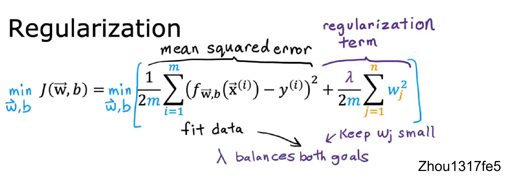

我们想要最小化\[原始代价函数即均方误差项+第二项即正则化项\]

λ : 可以控制两个不同目标之间的取舍。

此函数有两个目的，目的一：最小化预测值与真实值之间的误差，更好的拟合训练集。目的二：试图减小$w_j$ ，使假设函数变得“简单”，防止过度拟合。

**两者相互平衡，从而达到一种相互制约的关系，最终找到一个平衡点，从而更好地拟合训练集并且具有良好的泛化能力。**

不同的λ值有什么影响？

使用线性回归的房价预测示例。

如果，λ等于0，那么正则项等于零，即根本没有使用正则化，会过度拟合。
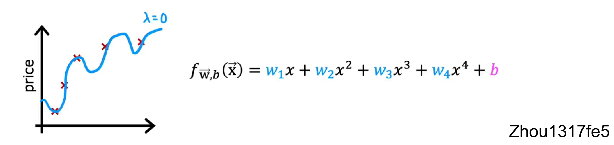

当λ非常非常大时，例如$\lambda=10^{10}$,那么$w_1到w_4$几乎等于0，只剩常数b项，此时会欠拟合。

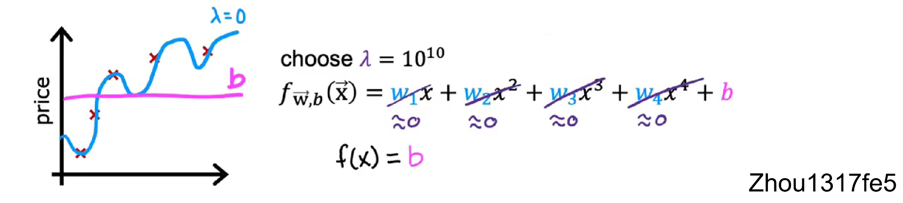

线性回归的正则化方法：
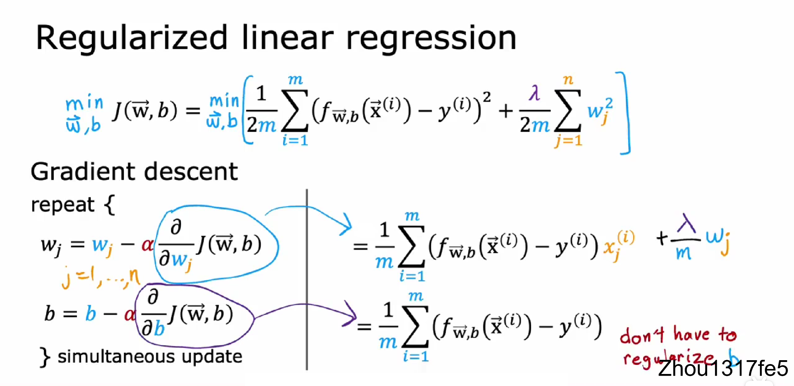

$$\begin{aligned}
& w_{j}=w_{j}-\alpha\left[\frac{1}{m}\sum_{i=1}^{m}\left[(f_{\vec{{{w}}},b}\big(\vec{x}^{(i)}\big)-y^{(i)}\big)x_{j}^{(i)}\right]+\frac{\lambda}{m}w_{j}\right]  \\
&b=b-\alpha\frac{1}{m}\sum_{i=1}^m(f_{\vec{\mathbf{w}},b}(\vec{\mathbf{x}}^{(i)})-y^{(i)})
\end{aligned}$$

逻辑回归的正则化方法：
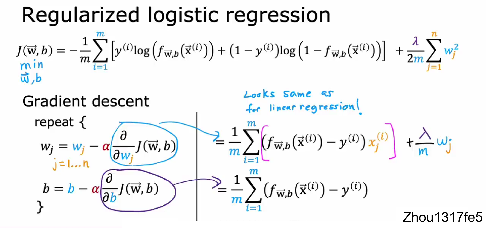

参考资料：[吴恩达机器学习笔记（三）正则化](https://zhuanlan.zhihu.com/p/75364861)

