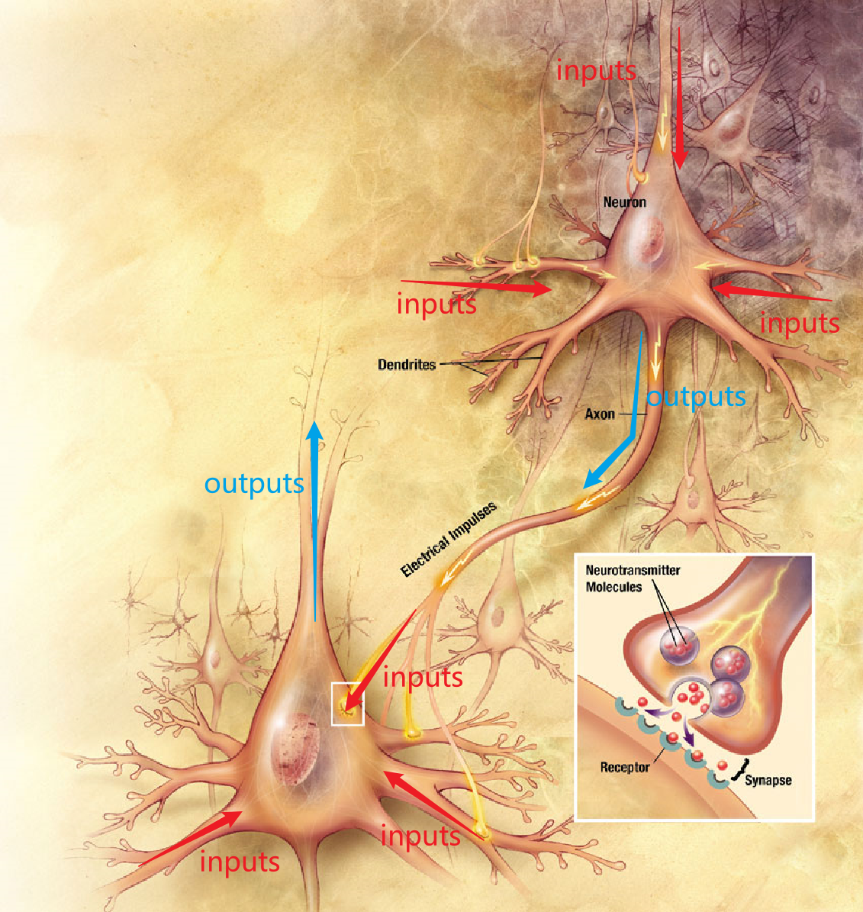
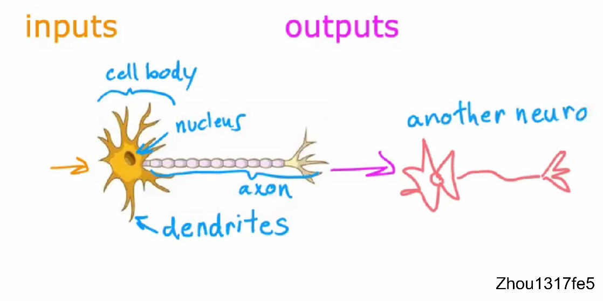

# 神经网路

什么是神经网络（Neural Networks）？最开始科学家想用算法去模拟大脑达到人工智能。通过一系列的实验发现，大脑是通过神经元进行工作的，神经元之间通过电信号传递信息。于是他们就开始模拟神经元的工作过程，用算法去模拟神经元，这就形成了神经网络。神经网络可以用来学习复杂的**非线性假设模型**。

为了构建神经网络模型，我们需要首先思考大脑中的神经网络是怎样的？

大脑中的神经元接受许多输入的信息，并进行一些计算和处理，计算后通过电脉冲发送给其他的神经元。上层神经元的输出又成为下层神经元的输入，下层神经元再次聚合来自其他神经元的输出作为该神经元的输入，然后将自己的输出发到其他神经元。这便是大脑中神经网络的工作原理。




我们将神经元简化如下：


每一个生物神经元都可以被认为是一个处理单元/神经核（**processing unit**/**Nucleus**），它含有许多输入/树突（**input**/**Dendrite**），并且有一个输出/轴突（**output**/**Axon**）。生物神经元会发送电脉冲，成为另一个神经元的输入。神经网络是大量神经元相互链接并通过电脉冲来交流的一个网络。

所有**人工神经网络**使用的是非常简化的生物神经元的数学模型。

我们用圆圈表示一个神经元，神经元所做的就是接受一个或多个输入，这些输入为数字，它进行一些计算后，输出一些数字，这些数字又作为下一层神经元的输入。我们构建人工神经网路时，通常同时模拟多个这样的神经元，而不是构建一个。


## 神经网络如何工作的？

### 案例一

我们用需求案例来了解神经网路时如何工作的，这个案例中目标是想知道那些短袖可能成为畅销品，以来规划更好的库存水平和营销活动。收集的数据有：不同短袖的价格，以及是否是畅销品。


在此示例中，输入特征X是短袖的价格，如果应用逻辑回归sigmoid函数来拟合这些数据，那么预测输出则为$\frac1{1+e^{-(wx+b)}}$


在神经网络中，我们用a来表示算法的输出，a代表激活（activation），来源于神经科学的一个术语，指的是一个神经元向下游其他神经元发送多少高输出。

这个逻辑回归单元可看作大脑中单个神经元非常简化的数学模型。这个人工神经元所要做的就是，将价格X输入，然后利用sigmoid函数公式 $\frac1{1+e^{-(wx+b)}}$ 计算出输出值a，输出的则为这件短袖可能成为畅销品的概率。

鉴于对单个神经元的描述，构建神经网络只需要将这些神经元并在一起，并将他们连接起来。

### 案例二

接下来我们看一个更复杂的需求预测案例，在该案例中我们用四个特征来预测短袖是否为畅销品。四个特征为价格（price）、运费（shipping cost）、营销手段（marketing）、材料质量（material）。我们假设短袖是否能成为畅销品取决于以下几个因素：
1. affordability - 对这件短袖人们是否**可负担**的起?支付能力
2. awareness    - 潜在买家对这件短袖的**认识程度**如何？短袖是否知名
3. perceived quality - **感知质量**，人们是否有偏见或潜在偏见说这是一件高质量的短袖？


**首先**，我们要创建一个人工神经元来估计这件短袖被人们认为是可负担的起的概率。支付能力主要是价格和运费的函数，因为一件短袖的支付总额是价格加上运费。所以在这里我们使用一个神经元，一个逻辑回归单元来输入价格和运费，并预测人们是否负担的起。


**接着**，创建一个人工神经元来预测潜在买家对这件T恤衫的认识程度。短袖知名程度归因于营销手段。**最后**，要创建另一个神经元来估计人们是否认为这是高质量的短袖。这可能是短袖价格和材料质量的函数。


鉴于对可负担性（affordability）、认识程度（awareness）、感知质量（perceived quality）的预测，我们将这三个神经元的输出连接到右侧另一个神经元，然后该神经元输入这三个数字并输出可能成为畅销品的概率。

==神经网络可看作逻辑回归，但是这个逻辑回归可以学习自身更好的特征，不需要手动设计，从而进行更准确的预测（神经网络=自动化特征工程+逻辑/线性回归）==

在神经网络术语中我们把，我们将把这三个神经元组合在一起，形成谓的**层（layer）**，层是一组神经元，它们将相同或相似的特征作为输入，然后一起输出一些数字，右边神经元也为层，所以层可以有一个或多个神经元。

右边这一层也叫做**输出层**（output layer），因为最后一层输出的是整个神经网络的预测值。最左边输入的四个特征也叫**输入层**（input layer）。在输入层和输出层中间的所有层都叫**隐藏层**，在神经网络中输入层和输出层都有明确的数值，而中间的层并没有告诉确切的数值，是未知的。

我们还将 affordability、awareness、perceived quality 叫做激活（activations）。激活源于生物神经元，它指的是生物神经元向下游其他神经元发送的高输出值或发送许多电脉冲的程度。这些关于affordability、awareness和perceived quality的数字是该层中这三个神经元的激活。同样输出概率是右侧这个神经元的激活。


至此，我们手动选择了那个神经元需要那几个特征作为输入，但神经网络在实践中层中的每一个神经元都可以访问上一层的每一个特征，从输入层访问每个值。


你可以想象，如果试图预测短袖的可负担性，并且它知道价格、运费、营销和材料，你可能会忽略营销和材料，只注重于价格和运费。我们就可以通过适当地设置参数来找出那些特征与负担能力最相关，比如价格和运费权重较大，而营销和材料的权重较小。


## tensorflow中的数据形式

tensorflow输入的是**二维向量**，计算效率更高。


numpy输入 - tensorflow转换成自己内部的数据形式tensor - tensforflow输出的数据形式也为tensor


## 伪代码实现向前传播
dense函数的作用是输入上一层的激活，并给定当前层的参数，返回下一层的激活，大写字母M代表矩阵，小写w代表向量和标量：
```python
def dense(a_in,W,b,g):
	units = W.shape[1]
	a_out = np.zeros(units)
	for i in range(units):
		w = W[:,i]
		z = np.dot(w,a_in)+b[i]
		a_out[i] = g(z)
	return a_out
```


sequential函数将几个dense层串在一起，以便在神经网络中实现前向传播，三层神经网路：
```python
def sequenttial(x):
	a1 = dense(x,W1,b1,g)
	a2 = dense(a1,W2,b2,g)
	a3 = dense(a2,W3,b3,g)
	f_x = a3
	feturn f_x
```

矢量化（代码有误），matmul用于矩阵乘法：


# 激活函数

## 常见的激活函数


注：使用线性激活函数等于没事使用激活函数。

## 如何选择激活函数

### 输出层

- 如果处理的是二元分类问题，在输出层选用sigmod函数。
- 处理的是回归问题，例如股票的涨跌，有正有负，输出层用线性激活函数。
- 如果只能取非负，例如房价问题，输出层则用ReLU激活函数。

### 隐藏层

最常用ReLU激活函数。

ReLU激活函数相对于sigmod函数计算更快。如果你使用梯度下降来训练神经网络，那么当有一个函数在很多地方都很平缓时，梯度下降会非常慢。 我们知道梯度下降优化了W,B的成本函数J，而不是优化激活函数，但是激活函数是计算的一部分，这导致W,B的成本函数J有更多的地方也是平坦的，并且梯度很小，这会减慢学习速度，所以计算会变慢。 

#### 隐藏层为什么不使用线性函数作为激活函数？（为什么模型需要激活函数）

对隐藏层和输出层都使用线性激活函数的效果等于使用线性回归模型。线性函数的线性函数依然为线性函数。


对隐藏层使用线性激活函数，对输出层使用sigmod激活函数的效果等于使用逻辑回归模型。


中间如果都用线性回归激活函数，最后得出来得结果和中间得隐藏层没有关系，只和输入的X有关系，相当于这个模型什么都没有做，逻辑回归也是同理。


# 多分类问题

### Softmax回归

当有四种分类时：


普试：

$a_{j}$被解释为给定输入特征x时模型对y等于j的概率。

### Softmax回归的损失函数

损失函数衡量的是在一个训练样例上的表现如何，所以对于一个特定的训练样本，y只能取一个值。因此最终只能针对 ${a}_j$ 的一个值计算 ${a}_j$ 的负对数，即在该特定训练样本中y的实际值等于j的任何值。例如，当y等于2时，损失函数只计算 $-\log a_{2}$ 

### 神经网络的Softmax输出

sigmod激活函数，激活值 ${a}_1$ 仅是 ${z}_1$ 的函数 ，${a}_2$ 也只是 ${z}_2$ 的函数。但是对于softmax函数，每一个激活值都取决于Z的所有值。

### Tensorflow实现
基本实现：


更好的实现：（P68）


目的在于减小计算误差。计算机是将数字转换为二进制计算数值的，会有误差。原来是先计算出a，再将a带入到损失函数中计算损失函数，这种利用中间值计算的损失函数具有误差。

现在softmax不再单独计算，在计算cost时将a嵌入损失韩素内部一起算了。并且输出层为 liner，这样输出层只会直接输出Z的值，不再带入softmax计算了。
完整代码：


逻辑回归优化代码：


epochs 迭代次数。

# 多标签分类问题


多标签分类问题是指对一个样本进行多个类别的分类，而不是将样本分到唯一的类别中。在多标签分类问题中，每个样本可以属于多个类别，类别之间是相互独立的。

举个例子，假设我们有一个图像识别任务，需要对图像进行多个标签的分类，比如识别图像中的汽车、公交车、行人。一张图像可能同时包含多个标签，比如既有人又有汽车。

训练三个单独的模型，分别识别有没有汽车、公交车、行人。
训练一个模型一次识别完。输出层有三个sigmod神经元，因此我们解决的是三个二分类问题。


# 高级优化算法 Adam算法

梯度下降是一种广泛用于机器学习的优化算法，是线性回归和逻辑回归等许多算法以及神经网络早期实现的基础。

**Adam算法**可以比梯度下降更快的训练神经网络。该算法可以自动调整学习率。


并且对模型的每个参数使用不同的学习率。


对于左图，如果它朝着大致相同的方向移动，Adam算法会自动增加该参数的学习率，加快计算。相反对于右图，如果参数不断来回摆动，我们不要让它继续来回摆动弹跳，Adam算法会稍微减少该参数的学习率。

代码实现：

