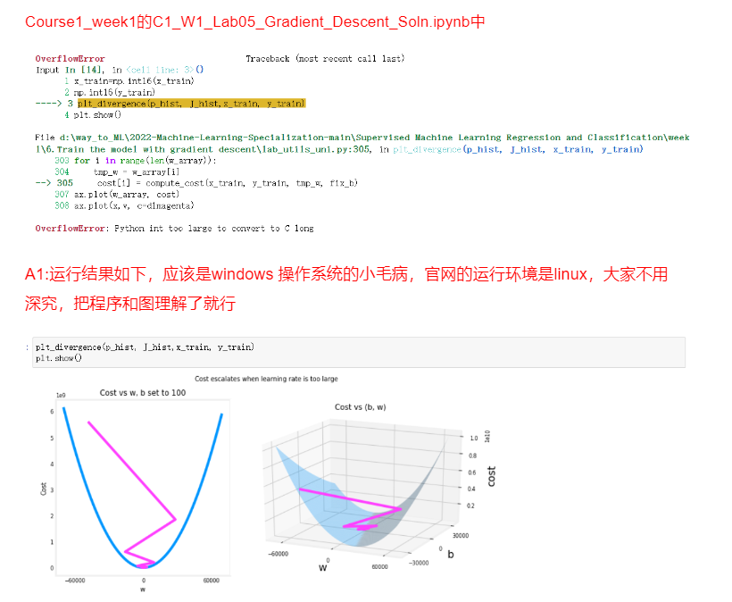

<<<<<<< HEAD

In the optional lab, you’ll see a review of the gradient descent algorithm, as well as how to implement it in code.

You will also see a plot that shows how the cost decreases as you continue training more iterations.  And you’ll also see a contour plot, seeing how the cost gets closer to the global minimum as gradient descent finds better and better values for the parameters w and b.
=======

In the optional lab, you’ll see a review of the gradient descent algorithm, as well as how to implement it in code.

You will also see a plot that shows how the cost decreases as you continue training more iterations.  And you’ll also see a contour plot, seeing how the cost gets closer to the global minimum as gradient descent finds better and better values for the parameters w and b.
>>>>>>> b58d112a39f17a751a94c381c189bff41f879de8
